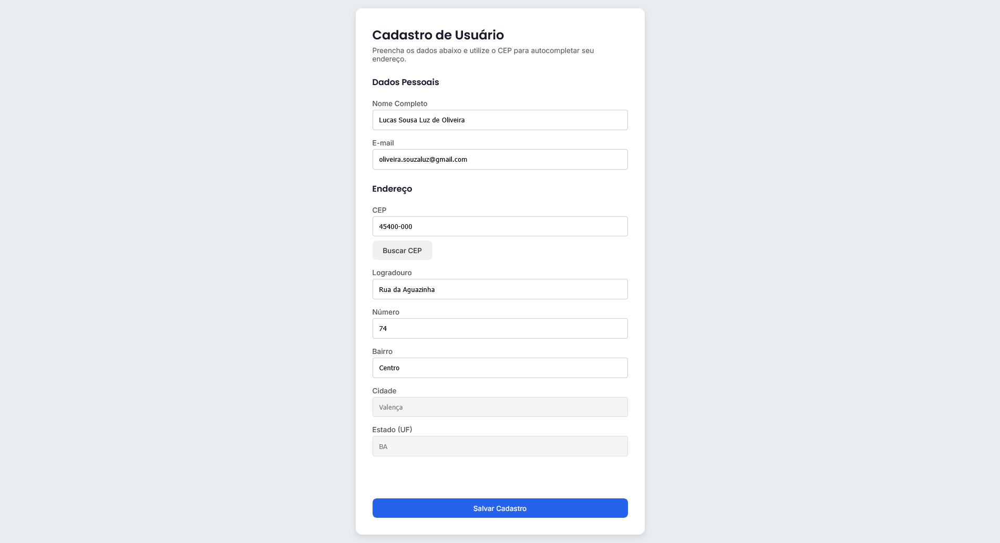

# 📋 Cadastro de Usuários

Aplicação web de cadastro de usuários com preenchimento automático de endereço via CEP e persistência de dados no navegador.

## 🚀 Funcionalidades

- **Busca de CEP** — preenchimento automático do endereço utilizando a API pública [ViaCEP](https://viacep.com.br)
- **Persistência de dados** — formulário salvo no `localStorage`, restaurando as informações mesmo após recarregar a página
- **Validação de campos** — verificação do CEP antes de realizar a requisição
- **Feedback visual** — mensagens de sucesso e erro exibidas na própria página
- **Campos inteligentes** — cidade e estado desabilitados até a busca do CEP ser realizada

## 🛠️ Tecnologias utilizadas

- HTML5
- CSS3
- JavaScript (ES6+)
- [Fetch API](https://developer.mozilla.org/pt-BR/docs/Web/API/Fetch_API)
- [Web Storage API](https://developer.mozilla.org/pt-BR/docs/Web/API/Web_Storage_API)
- [ViaCEP API](https://viacep.com.br)
- [Google Fonts](https://fonts.google.com) — Inter e Poppins

## 📁 Estrutura do projeto

```
cadastro-usuarios/
├── index.html    # Estrutura da aplicação
├── styles.css    # Estilos e layout
├── scripts.js    # Lógica e integração com APIs
└── README.md     # Documentação
```

## 💻 Como usar

1. Clone o repositório:
```bash
git clone https://github.com/lucassloliveira/cadastro-usuario.git
```

2. Abra o arquivo `index.html` no navegador — não é necessário servidor ou instalação.

## 🌐 Deploy

Acesse a aplicação em produção via GitHub Pages:
```
https://github.com/lucassloliveira/cadastro-usuario
```

## 📷 Preview



## 📌 Como funciona

1. Preencha os dados pessoais (nome e e-mail)
2. Digite o CEP e clique em **Buscar CEP** — o endereço é preenchido automaticamente
3. Informe o número e complemento (se houver)
4. Clique em **Salvar Cadastro** — os dados ficam salvos no navegador
5. Ao recarregar a página, o formulário é restaurado automaticamente

## 📄 Licença

Este projeto foi desenvolvido para fins de estudo.
